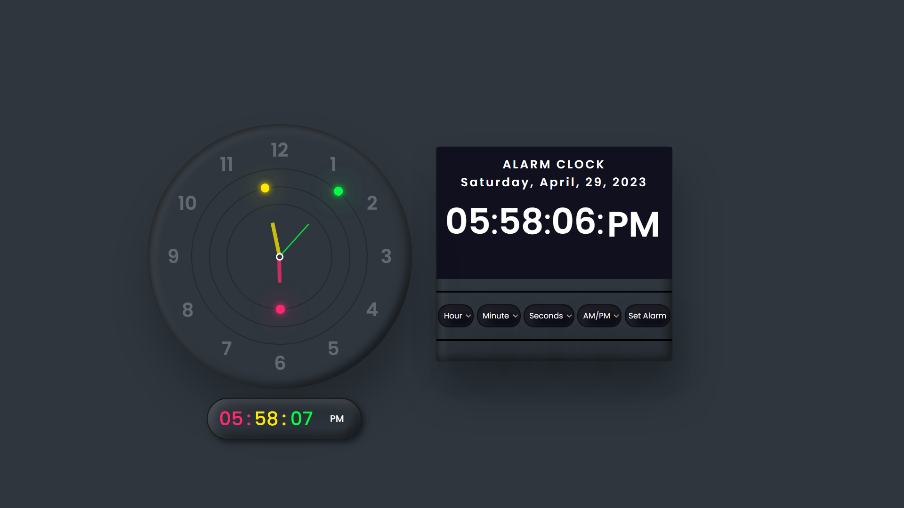

# Alarm-Clock
Alarm Clock By Pralay Krishna Pramanik

# Alarm-Clock using Vanilla JavaScript

<li>This is a repository for Alarm Clock Developed using Vanilla JavaScript, HTML, CSS.</li>
 
<li> It is developed to create a soothing Experience with powerful features and clean interface.</li>
 

# Problem Statement

Create an alarm clock. Use ONLY vanilla javascript, no libraries or frameworks allowed for Javascript (you can use any css framework like Bootstrap).
 

# Features Required

- <b>Clock face</b> 

  Clock showing the current time (seconds,mins,hrs should change as time changes)

- <b>Set Alarm</b>  

  - Provide input boxes to set an alarm (hr,min,sec, am/pm)
  - Once the sets the time and click “Set Alarm” button, add that alarm to the alarms list below
  - When the alarm goes of just use JS alert function to alert in the browser

- <b>Alarms list</b>  

  - Display a list of all the alarms set by user
 
- <b>Delete alarm</b>  
  - For each alarm give a delete button to delete the alarm
  - When the user deletes an alarm make sure it “does not alerts the user”

 

# Create an alarm clock. Use ONLY vanilla javascript, no libraries or frameworks allowed for Javascript (you can use any css framework like Bootstrap).

1.Create an alarm clock. Use ONLY vanilla javascript, no libraries or frameworks allowed for Javascript (you can use any css framework  like Bootstrap).
 
2.Add some basic CSS styling to the HTML elements using a CSS framework like Bootstrap.
 
3.Add some basic CSS styling to the HTML elements using a CSS framework like Bootstrap.
 
4.Add some basic CSS styling to the HTML elements using a CSS framework like Bootstrap.
 
5.We'll also need to create an event listener for the "Set Alarm" button. When this button is clicked, we'll store the alarm time in the `alarmTime` variable.
 
6.Finally, we'll create another setInterval method to check if the current time matches the alarm time, and if it does, play a sound.
 

# HTML FILE
/---------------------------------------------/

an HTML file that defines a webpage for an alarm clock. It includes the necessary tags and elements to display an analog clock, a digital clock, and an alarm feature. The code imports an external CSS file to style the page and an external JavaScript file to handle the alarm functionality.

The analog clock is created using three circles with different colors for the hour, minute, and second hands. The circles are positioned using CSS and are rotated based on the current time using JavaScript.

The digital clock displays the current time in hours, minutes, seconds, and AM/PM format. The clock is also updated dynamically using JavaScript.

The alarm feature allows users to set an alarm by selecting the hour, minute, second, and AM/PM from dropdown menus. The code includes a button to set the alarm, and another button to stop the alarm. The alarm feature also includes a list of all the set alarms, displayed as a simple text list on the page.

Overall, this HTML file defines the structure and content of a webpage for an alarm clock, including both the visual display and the necessary JavaScript code to handle the clock and alarm functionality.

/--------------------------------------------------------------------------------------------------------------------------------------/

# AN CSS
/--------------------------------------------/

a CSS code for an alarm clock interface. It imports a font from Google Fonts, sets some default styles for all elements, and defines the main styles for the alarm clock interface.

The alarm clock interface has a container with the class alarm. The container has a solid border, rounded corners, and a background color. It also has a box-shadow effect that gives it a 3D appearance.

Inside the container, there is an element with the class datetime that shows the current date and time. The datetime element has a solid background color, rounded corners, and a box-shadow effect. When the user hovers over the datetime element, its background color and box-shadow effect change.

The datetime element is divided into two sections: the date and the time. The date is shown in a smaller font size and has a letter-spacing effect. The time is shown in a larger font size and is centered. The time is further divided into three span elements: one for the hours, one for the minutes, and one for the seconds. The span elements for the hours and minutes have a maximum width property, which allows the time to be centered. The span element for the seconds is uppercase and has a background color, padding, and rounded corners.

Below the datetime element, there is a horizontal line that separates it from the alarm setting section. The alarm setting section has a container with the class setAlarm, which has a flexible layout and evenly spaces its child elements. The child elements include two select elements for choosing the alarm time and a button with the id btn-setAlarm for setting the alarm. There is also a button with the class btn-delete for deleting the alarm, and a button with the id stopAlarm for stopping the alarm when it goes off.

The select elements have a solid background color, rounded corners, and a box-shadow effect. The buttons have the same styles as the select elements but also have a hover effect. The stopAlarm button is initially hidden and becomes visible when the alarm goes off. Finally, there is a h3 element at the bottom of the interface with a font style and color.

/------------------------------------------------------------------------------------------------------------------------------------/

# AN JAVASCRIPT
/------------------------------------------/

The code seems to be a combination of an analog clock, a digital clock, and an alarm clock. The analog clock shows the time with hour, minute, and second hands, while the digital clock displays the time, date, and day of the week. The alarm clock allows the user to set an alarm time using a select menu and delete it later. When the set alarm time matches the current time, an audio alarm will ring, and a stop button will appear to stop the alarm sound.

The program first sets up the variables and audio file for the alarm clock. The analog clock is created using three elements for the hour, minute, and second hands. The digital clock is created by defining the time, date, and day of the week in a function, which is called every second using setInterval().

The setAlarm() function takes input from the select menus for the hour, minute, and second, and AM/PM, to create the alarm time. It then checks if the input is valid and adds the alarm time to an array of alarm times. The deleteAlarm() function takes an id and uses it to remove the corresponding alarm time from the array and delete the alarm log from the DOM.

Overall, the code seems to be working as intended, but there could be room for improvement, such as adding the ability to modify alarms, adding more audio options for the alarm sound, and adding a more user-friendly interface for the select menus.

/--------------------------------------------------------------------------------------------------------------------------------/

# PRODUCT DEMO

![Alarm-Clock]    

# LINKS

<a href = "https://pralay2605q.github.io/Alarm-Clock/"> <b>LIVE PRODUCT</b> </a>  &nbsp; <a href = "https://github.com/Pralay2605Q/Alarm-Clock"> <b>CODE</b> </a>  

--------------------------------------------------------------------------------------------------------------------------------------------------------
 
<strong>Connect With Me @</strong>

